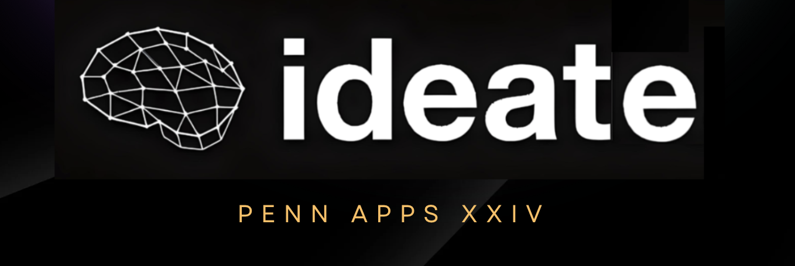

# Ideate



## Table of Contents
- [Introduction](#introduction)
- [Features](#features)
- [Installation](#installation)
- [Usage](#usage)
- [Contributing](#contributing)
- [License](#license)

## Introduction

Welcome to **Ideate**, a revolutionary platform that helps both developers and students quickly transform their pseudocode and high-level system design directly into production-level software in the language of their choice. This open-source project was developed by [Julius Broomfield](https://www.linkedin.com/in/juliusbroomfield/), [Shishir Vargheese](https://www.linkedin.com/in/shishir-vargheese/), [Ammaar Anjum]([https://github.com/AmmaarsCode](https://www.linkedin.com/in/ammaar-anjum-477898245/)), and [Ibrakhim Ustelbay](https://www.linkedin.com/in/ibrakhim/) to streamline the coding process and bridge the gap between ideas and implementation.

Ideate enables users to turn to classic whiteboard coding with a modern twist. Simply set up your webcam, turn on your microphone, ideate, and we'll take it from there. Whether you're a seasoned developer looking to turn your ideas into code or a student learning the ropes of software development, Ideate is your go-to platform for efficient coding.

## Features

### 1. Pseudocode to Production
Easily transform your pseudocode and high-level system design into production-ready code in your preferred programming language.

### 2. Webcam Coding
Utilize the power of classic whiteboard coding with the convenience of modern technology. Set up your webcam, turn on your microphone, and start coding by speaking or sketching your ideas.

### 3. Language Agnostic
Ideate supports multiple programming languages, allowing you to code in the language that best suits your project or learning needs.

### 4. Real-time Assistance
Receive real-time assistance and suggestions as you code, making the development process smoother and more productive.

## Installation

To run Ideate locally or deploy it on your own server, follow these steps:

1. Clone the repository:
   ```bash
   git clone https://github.com/JuliustheCreator/ideation.git
   ```

2. Install the required dependencies:
   ```bash
   cd ideation
   npm install
   ```

3. Configure your environment variables. You can create a `.env` file in the root directory and set the necessary variables. Example:
   ```env
   PORT=3000
   MONGODB_URI=your_mongodb_uri
   SESSION_SECRET=your_session_secret
   ```

4. Start the application:
   ```bash
   npm start
   ```

Ideate should now be up and running on your local machine.

## Usage

1. Visit the Ideate website (or the local server if you've set it up locally).
2. Sign up for an account or log in if you already have one.
3. Set up your webcam and microphone for coding.
4. Start your coding session by speaking or sketching your ideas.
5. Ideate will automatically transform your pseudocode and design into production-level code.
6. Receive real-time assistance and suggestions to enhance your coding experience.

## Contributing

Contributions to Ideate are welcome! Whether you want to report a bug, suggest new features, or contribute code, please check out our [contribution guidelines](CONTRIBUTING.md) for more information.

## License

Ideate is open-source software released under the [MIT License](LICENSE). You are free to use, modify, and distribute this software for your own projects. See the [LICENSE](LICENSE) file for more details.

We hope Ideate revolutionizes your coding experience, making it faster, more efficient, and more enjoyable. If you have any questions or feedback, please feel free to [contact us](https://github.com/JuliustheCreator/ideation/issues).

Happy brainstorming with Ideate! 🚀🌟
